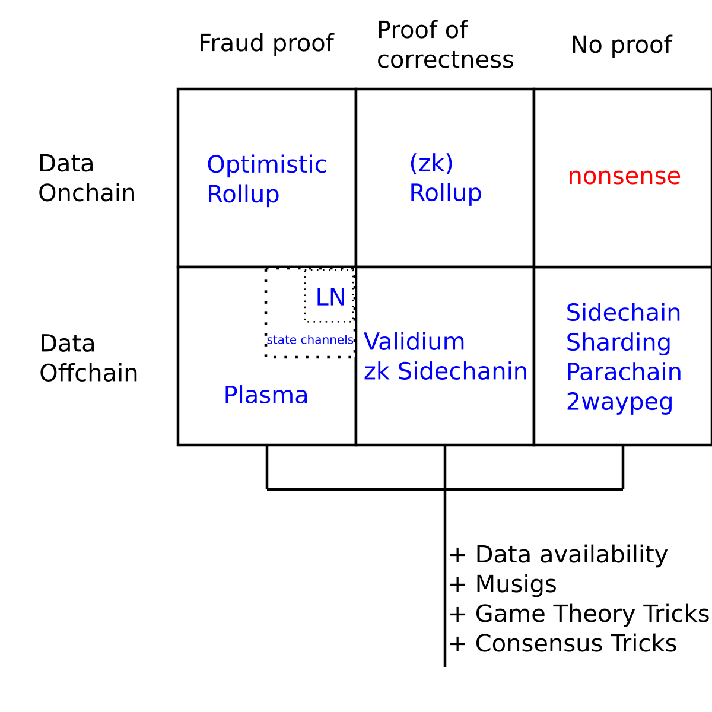

# L2 Mind Map

# Sidechains

## Pro:

1. Cheap
2. Unlimited txs
3. Unlimited users

## Cons:

1. Only game theoretical garanties (or trust)
2. Only one secure trustless chain

&nbsp;

&nbsp;

&nbsp;

# State channels/LN

## Pro:

1. High level of trustless
2. Unlimited amount of transaction

## Cons:

1. Money lock 
2. Low capital efficiency
3. Dust level security (without collective security)
4. Unrealistic onboarding
5. Scaling amount of tx (not amount of user)

&nbsp;

&nbsp;

&nbsp;

# Plasma

## Pro:

1. Unlimited amount of user

## Cons:

1. Data availability is disaster

&nbsp;

&nbsp;

&nbsp;

# optimistic rollup

## Pro:

1. Unlimited amount of user
2. High level of trustless

## Cons:

1. Limited level of scalability
2. Miner attack is disaster

&nbsp;

&nbsp;

&nbsp;

# (zk)rollup

## Pro:

1. Unlimited amount of user
2. High level of trustless
3. Compact data related to optimistic rollup

## Cons:

1. Limited level of scalability

&nbsp;

&nbsp;

&nbsp;

# zk Sidechains

## Pro:

1. Unlimited amount of user
2. Unlimited amount of tx
3. Constant proof size

## Cons:

1. Data availability is problem. Without data fund can be freezed

&nbsp;

&nbsp;

&nbsp;

### PS: Sharding doesn't work because "adaptive corruption"